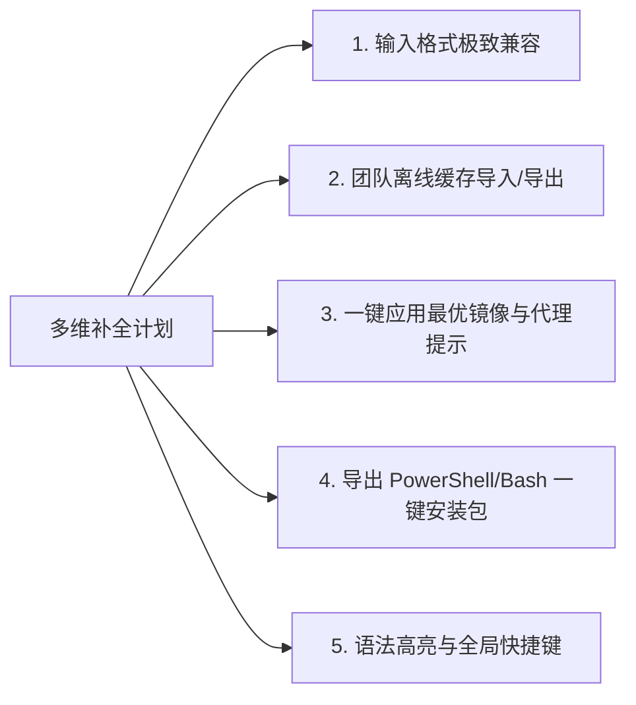

# mod_UI 系统深度功能补全与极致体验增强方案

> 生成日期: 2026-08-01 | 类型: 分析报告 | 状态: 已完成

## 背景

在完成前两轮关于系统逻辑审查与 Conda/Pip 多生态扩展设计的基础上，针对 `mod_UI` 桌面端应用程序的实际使用场景（包括单细胞/空间转录组数据分析、生信内网堡垒机环境、团队协同与自动化运维），进行了全维度的交互细节与功能完整性盘点。

为了将 `mod_UI` 打造为具备极致用户体验、防错防护与团队协同能力的产品，本方案系统梳理了 6 大维度的补全完善与体验增强项。

---

## 问题分析与细节盘点

### 1. 文本输入与智能清洗细节 (Input Normalization)

- **细节不足**：目前输入智能清洗支持 `c()`, `install.packages()`, `BiocManager::install()` 等常用函数，但在实际拷贝科研论文、博客或微信/钉钉消息时，用户经常粘贴带中文全角标点（如 `，` `、` `；`）的包名列表，或包含 `pacman::p_load(...)`、`renv::install(...)` 等高级包管理器的调用。
- **优化方向**：扩展正则清洗链，实现中文全角标点自动替换拆分，并全面覆盖 `pacman`, `renv`, `pak`, `Dockerfile RUN` 语句中的包名抽取。

### 2. 离线/内网团队共享支持 (Offline Team Sharing)

- **细节不足**：现有离线缓存 (`cache.json`) 仅存储于当前终端的 Tauri 应用数据目录中。在内网/堡垒机环境中，无网终端无法联网查询最新版本。
- **优化方向**：增加“一键导出缓存索引 JSON”与“导入团队共享缓存”功能，允许有网终端导出权威包元数据，供内网团队直接共享导入使用。

### 3. 网络代理与镜像测速闭环 (Smart Proxy & Mirror Optimization)

- **细节不足**：`SettingsView` 中测速完成后仅列出延迟，用户仍需手动选中下拉框；网络诊断抛出底层 Socket 错误时，缺乏对常见本地代理端口（如 7890/10809）的针对性修复排查指引。
- **优化方向**：测速列表新增【一键选为当前镜像】和【推荐最快镜像】智能按钮；网络测试异常时增加针对性解法提示（如检查 Clash/V2Ray 本地监听设置）。

### 4. 自动化 Shell/PowerShell 包装脚本生成 (Wrapper Script Export)

- **细节不足**：目前生成的 R 脚本在 PowerShell 或 Linux Bash 中执行时，需要用户手动启动 R 终端粘贴。
- **优化方向**：提供【导出 `.ps1` 脚本】或【导出 `.sh` 脚本】按钮，一键包装 `Rscript -e "..."` 及错误自动捕获、日志重定向逻辑，方便在服务器 CI/CD 或批处理任务中直接运行。

### 5. 生态环境版本匹配预警 (Version Compatibility Warning)

- **细节不足**：部分 Bioconductor 包受限于当前系统的 R 版本（如 Bioc 3.18 依赖 R 4.3，Bioc 3.19 依赖 R 4.4）。
- **优化方向**：增加 R 与 Bioconductor 发行版的版本对应预警，提示可能存在的依赖不匹配风险。

### 6. 前端 UI 语法高亮与快捷键响应 (UI Polish & Keyboard Shortcuts)

- **细节不足**：脚本展示区为纯文本框，缺少语法着色；缺乏快捷键对核心操作（如 `Ctrl+Enter` 启动检索、`Esc` 关闭弹窗）的全流程响应。
- **优化方向**：在前端增加轻量 R 语法着色渲染（注释、字符串、函数名高亮），并建立统一的键盘快捷键响应系统。

---

## 核心发现与补全路线图

---

## 实施方案与功能增强对照表

| 维度 | 当前实现 | 拟增强/补全功能 | 带来的价值 |
|------|----------|------------------|------------|
| **输入清洗** | 基础半角分隔符与常用函数 | 支持中文标点（`，` `、`）、`pacman` / `renv` 智能抽取 | 粘贴微信/论文文本零门槛解析 |
| **团队协同** | 本地单机缓存 | 离线缓存 JSON 一键导出/导入 | 解决内网/堡垒机团队元数据共享问题 |
| **网络设置** | 镜像延迟列表显示 | 一键套用最快镜像 + 常见代理错误诊断指引 | 提升网络配置体验与故障自排效率 |
| **运维自动化** | 导出纯 R 脚本文本 | 一键生成 `.ps1` / `.sh` 自动化脚本包装 | 方便服务器批量部署与 CI/CD 继承 |
| **UI/UX 体验** | 纯文本预预览 | R 代码语法着色 + `Ctrl+Enter` 快捷键启动 | 提升交互视觉质感与高频使用效率 |

---

## 风险评估与缓解

| 风险项 | 影响范围 | 可能性 | 缓解措施 |
|--------|----------|--------|----------|
| 离线缓存导入版本覆盖 | 本地数据 | 低 | 导入时采用合并模式（Merge），新版本或可信数据覆盖旧数据，不破坏现有映射 |
| 快捷键触发与 TextArea 冲突 | 前端交互 | 低 | `Ctrl+Enter` 仅在非 Composing 模式下触发，避免影响中文输入法选词 |

---

## 最终建议

按以下优先顺序进行迭代落地：
1. **优先增强文本清洗与快捷键**：零风险、高回报，能极大提升日常高频操作体验。
2. **落地一键应用最快镜像与代理提示**：降低用户网络调试门槛。
3. **推行团队离线缓存导入导出与自动化 Shell 导出**：满足生信团队在内网环境与自动化部署的深度需求。

---

## 后续行动

- [ ] 在 `utils.ts` 中增强中文标点兼容与 `pacman` / `renv` 正则解析
- [ ] 在 `SettingsView.tsx` 中为镜像测速结果添加【应用此镜像】直接操作按钮
- [ ] 在 `storage.rs` 中新增离线缓存 `export_cache` / `import_cache` 命令
- [ ] 在 `WorkspaceView.tsx` 中绑定 `Ctrl+Enter` 快捷启动搜索

---

*文档由 document_writer skill 自动生成*
