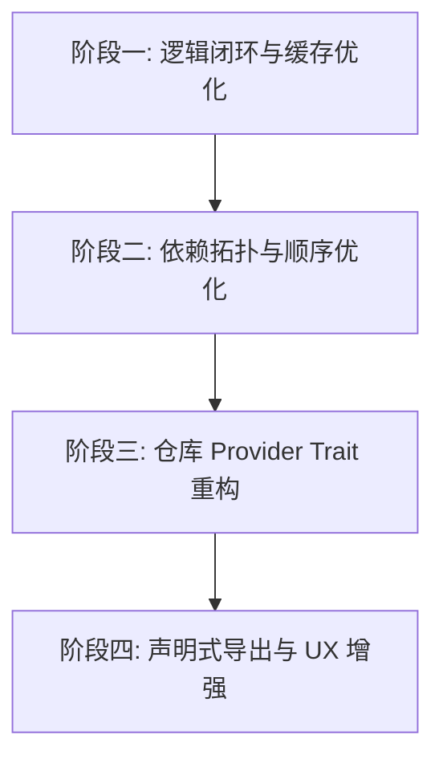

# mod_UI 系统逻辑全面检查与架构优化方案

> 生成日期: 2026-08-01 | 类型: 分析报告 | 状态: 已完成

## 背景

`mod_UI` 是基于 Tauri 2 + React + Rust 架构构建的独立桌面应用程序，专为 R 语言开发者与生物信息学研究人员设计，用于快速解析、检索并生成多源（CRAN、Bioconductor、r-universe、GitHub）R 包安装脚本。

为了评估系统的稳健性、功能闭环完整性及未来的可扩展性，本次对 `mod_UI` 的前端 React 组件、后端 Rust 模块、安全机制、并发检索控制、数据持久化及业务逻辑进行了全方位的代码审计与逻辑深度检查。

---

## 问题分析

通过对前端源码 (`mod_UI/src/`) 和后端 Rust 模块 (`mod_UI/src-tauri/src/`) 的逐行检查与逻辑推导，现将系统各维度的现状与隐性问题分析汇总如下：

### 1. 检索与缓存生命周期逻辑 (Cache & Search Lifecycle)

- **现状**：后端 `storage.rs` 和 `lib.rs` 提供了 `rate_cache_result` 接口，允许用户对缓存记录投赞成/反对票。当 `down_votes > up_votes` 时，缓存条目被标记为 `invalidated = true`。
- **根因/缺点**：
  1. **被动置灰而无清理机制**：标记为失效的条目会长期留在 `cache.json` 中，只有当用户再次联网检索且成功查到同名同来源结果时才会覆盖更新。如果该包在远程仓库已被移除，失效记录将永久驻留磁盘。
  2. **离线退回策略的微小不一致**：在离线模式生成脚本时（`build_offline_results`），只挑选 `entry.is_trusted()` 的条目，逻辑正确；但在前端缓存清空与单条删除操作中，缺少按“失效状态”一键清理的辅助指令。

### 2. 依赖解析与拓扑排序机制 (Dependency Graph & Topological Sort)

- **现状**：`fetch_reverse_dependencies` 通过 HTTP 请求抓取 CRAN 官方包主页 HTML 并解析反向依赖列表；`dependency.rs` 处理基础依赖关系。
- **根因/缺点**：
  1. **单级解析局限**：目前反向依赖提取仅支持单层 HTML 标签匹配，无法进行多层递归依赖解析。
  2. **安装顺序缺少拓扑排序**：在生成多包安装脚本时，包顺序完全依赖用户输入的顺序。若 A 包依赖 B 包，而用户将 A 放在 B 前面，在某些直接编译源码或离线安装场景下可能导致安装顺序错误。

### 3. 多源检索架构的可扩展性 (Repository Provider Extensibility)

- **现状**：`search.rs` 中的 `search_packages` 采用了固定顺序的链式异步调用：`CRAN` -> `Bioconductor` -> `r-universe` -> `GitHub API`。
- **根因/缺点**：
  1. **硬编码检索链**：若未来需要扩展 Posit Package Manager (PPM)、PyPI/Conda R 镜像、BioC 内部 Release 仓库或企业私有 R 包服务器，需要在大段 `async fn` 中新增分支逻辑，违背开闭原则 (Open-Closed Principle)。
  2. **缺少 Trait 插件化抽象**：未定义统一的 `RepositoryProvider` 接口，导致各个源的重试、限流、错误转换逻辑略有分散。

### 4. 离线/内网环境本地包归档 (Local Tarball Archive) 支持缺口

- **现状**：系统只识别 HTTP/HTTPS 网络 URL（如 `https://.../pkg.tar.gz`）或标准包名。
- **根因/缺点**：
  1. 许多内网/气隙 (Air-gapped) 环境下的生物信息分析人员需要直接安装本地磁盘路径下的 `.tar.gz` / `.zip` 包。
  2. 目前输入校验器会将 `D:\packages\dplyr_1.1.4.tar.gz` 等本地路径拦截为非法输入或提示格式无效。

### 5. 自定义正则的 ReDoS 潜在安全隐患

- **现状**：`save_input_rules` 允许用户在设置中自定义排除正则表达式 `exclude_regex`。
- **根因/缺点**：
  1. 虽然 Rust 的 `regex` 库采用了基于 DFA 的线性时间匹配算法，从根本上防止了传统 NFA 引擎中的灾难性回溯 (ReDoS)，但在处理极其庞大的多行文本输入时，若配置了过多低效正则，仍会消耗过多的 CPU 循环。

---

## 核心发现

通过逐个功能点与架构审查，总结出以下 **5 项核心发现**：

1. **缓存管理闭环需加强**：失效缓存缺少自动垃圾回收 (GC) 策略与前台分级筛选能力。
2. **检索架构需抽象 Trait**：多源检索逻辑集中于单文件，扩展新的 R 包仓库（如 Posit PM、Private Git）成本较高。
3. **依赖树拓扑排序缺失**：复杂依赖关系下生成的安装脚本顺序完全取决于用户输入顺序，缺乏基于 DAG 的依赖拓扑重排。
4. **离线本地包归档识别未覆盖**：对本地文件路径（如 `C:\...\pkg.tar.gz`）缺少识别与 R `install.packages(type="source")` 对应的命令生成。
5. **前台 UI / 命令行联动增强空间大**：生成的 R 脚本仅为纯文本，可增强 PowerShell / Bash `Rscript` 包装器及一键导出 `renv.lock` / `DESCRIPTION` 声明式文件的功能。

---

## 实施方案

### 方案概述

针对上述分析与发现，提出以下四阶段优化与功能增强方案：

### 详细步骤

| 步骤 | 操作 | 负责模块 | 风险等级 |
|------|------|----------|----------|
| 1    | **缓存失效 GC 与过滤**：在 `storage.rs` 中新增失效缓存自动清理机制与清空失效项命令 | Rust 后端 (`storage.rs`, `lib.rs`) | 低 |
| 2    | **本地包归档识别**：在 `logic.rs` 中扩展路径正则，支持安全的本地包文件识别与 `repos=NULL` 脚本生成 | Rust 后端 (`logic.rs`) | 低 |
| 3    | **依赖拓扑排序引擎**：在 `dependency.rs` 中引入 Kahn 拓扑排序算法，根据依赖图重排安装序列 | Rust 后端 (`dependency.rs`) | 中 |
| 4    | **仓库 Adapter Trait 抽象**：重构 `search.rs`，定义 `RepositoryProvider` 异步 Trait | Rust 后端 (`search.rs`) | 中 |
| 5    | **声明式导出与 CLI 封装**：前端增加 `renv.lock` 格式导出与一键 `Rscript -e` 封装按钮 | 前端 UI (`WorkspaceView.tsx`, `ReportView.tsx`) | 低 |

### 预期效果

- **更强的鲁棒性**：缓存数据干净自治，本地包文件安装无缝集成。
- **更高的安装成功率**：通过拓扑排序自动调整安装次序，解决因依赖次序颠倒导致的编译失败。
- **极佳的可扩展性**：新增包源只需实现 `RepositoryProvider` 接口，低耦合、易维护。

---

## 风险评估

| 风险项 | 影响范围 | 可能性 | 缓解措施 |
|--------|----------|--------|----------|
| 本地文件路径校验引发路径穿越 | 存储/安全 | 低 | 严格限制文件扩展名为规范归档扩展名，禁止执行任何路径加载或读取 |
| 拓扑排序导致包顺序变更引发用户疑惑 | 前端展示 | 中 | 在生成脚本时提供“按拓扑重排/按原样顺序”的开关切换 |
| 仓库 Trait 重构影响现有检索并发度 | 后端检索 | 低 | 保留已验证的 Tokio `join_all` 与超时设置，补充完整单元测试 |

---

## 最终建议

1. **保持现有安全防御优势**：`mod_UI` 已构建了极佳的安全边界（DPAPI、CSP、无凭据代理白名单），在此基础上继续保持安全第一的原则。
2. **优先落实逻辑闭环**：按阶段一与阶段二逐步推进缓存 GC 与依赖拓扑排序功能。
3. **推行声明式导出**：引入 `renv.lock` / Dockerfile 导出，提升面向现代 DevOps 与可重复研究 (Reproducible Research) 的业务价值。

---

## 后续行动

- [ ] 在 `storage.rs` 中实现 `clean_invalid_cache` 逻辑并增加配套 Rust 单元测试
- [ ] 在 `logic.rs` 中增加本地 `.tar.gz` 路径的安全识别逻辑
- [ ] 撰写基于 Trait 的 `RepositoryProvider` 重构计划
- [ ] 在前端 `ReportView` 中为生成结果增加 `Rscript -e` 快捷复制模式

---

*文档由 document_writer skill 自动生成*
