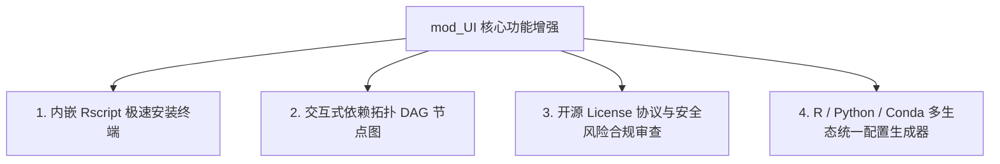

# mod_UI 项目全景完善与功能增强建议分析报告

> 生成日期: 2026-08-02 | 类型: 深度分析与规划 | 状态: 已完成

## 一、 背景与既有成果复核

`mod_UI` 作为专为 R 生态（兼顾 Python/Pip 与 Conda）打造的高性能包依赖解析、多源检索与脚本生成桌面客户端，在前期演进中已具备极高的完成度：
- **多源智能检索**：已覆盖 CRAN、Bioconductor、GitHub、GitLab、RSPM 及自定义 HTTP/HTTPS 归档包。
- **系统环境预检**：支持 Rtools、Rscript、Git、make、gcc、gfortran 工具链的跨平台检测与建议。
- **沙盒隔离与安全**：支持自定义 R 库路径（`.libPaths` 沙盒）透传，防范全局环境污染；内置白名单、解析校验与凭据脱敏。
- **运维与团队协作**：支持阶段耗时瀑布图、团队共享缓存导入导出（与合并）、 PowerShell (.ps1) / Bash (.sh) 包装器导出。

基于当前成熟度，本报告对 `mod_UI` 进行全景式代码与场景推演，提出了进一步补全完善的细节痛点，并设计了 4 大高价值突破性增强功能。

---

## 二、 需补全完善的细节与边缘场景

### 1. 系统级 C/C++ 依赖 (SystemRequirements) 智能识别与包指引
- **痛点分析**：R 语言生物信息学包（如 `sf`, `gdal`, `xml2`, `openssl`, `rgl`）在运行 `install.packages` 前，必须在操作系统层安装对应的 C/C++ 开发库（如 Linux 下的 `libgdal-dev`, `libxml2-dev`, `libssl-dev`）。
- **完善建议**：
  - 在 Rust 后端解析 DESCRIPTION 文本时，提取 `SystemRequirements` 字段。
  - 前端 ReportView 中新增【系统依赖库提示】组件，自动映射 Debian/Ubuntu (`apt-get install`) 与 CentOS/RHEL (`yum install`) 的安装命令，解决“R 脚本生成成功但系统缺失 C 库导致编译失败”的最后一公里障碍。

### 2. 科研工程配置文件直接拖拽/解析导入 (`renv.lock` / `DESCRIPTION` / `requirements.txt`)
- **痛点分析**：科研人员常用 `renv` 锁文件或已有的 `DESCRIPTION` 文件管理依赖，手动逐个输入包名效率较低。
- **完善建议**：
  - 工作台 `WorkspaceView` 增加文件拖拽与选择导入功能。
  - 支持解析 `renv.lock` JSON 结构、R `DESCRIPTION` 文件（`Imports`, `Depends`）以及 Python `requirements.txt`，自动提纯包名与版本约束直接填入检索队列。

### 3. CRAN 归档包 (Archived Packages) 智能探测与安装修正
- **痛点分析**：部分历史经典 R 包因维护不及时被 CRAN 官方移至 Archive 目录，标准 `install.packages` 会报错 `package ‘xxx’ is not available`。
- **完善建议**：
  - 当 CRAN 返回 404 或标注 Archived 时，自动回退探测 CRAN Archive 历史源码包路径（如 `https://cloud.r-project.org/src/contrib/Archive/xxx/`）。
  - 在生成的脚本中自动适配 `remotes::install_version()` 或源码包 URL 安装逻辑。

---

## 三、 值得添加的高价值功能增强

### 1. 【核心突破】内嵌极速安装终端与 Rscript 实时日志流 (Embedded Installation Terminal & Streamed Log)
- **功能描述**：在 ReportView 中增加【本地直接一键安装】按钮，桌面端在后台调用本地 `Rscript` 或系统 Shell 执行生成的脚本，并在前端界面下方内置终端/日志面板中**实时回显输出流 (Streamed stdout/stderr)**。
- **用户价值**：将客户端从“脚本生成器”升级为“全生命周期包管理引擎”。用户无需打开外部 PowerShell 或 R 终端，即可在桌面应用内实时观看编译安装进度与成功/失败结果。

### 2. 【视觉突破】交互式依赖拓扑 DAG 节点图 (Interactive Dependency DAG Visualizer)
- **功能描述**：基于包依赖树关系（Depends / Imports / LinkingTo），提供可视化 Canvas/SVG 拓扑图。
- **用户价值**：直观展示上百个包的依赖结构，支持点击高亮关键核心依赖包（如 `Rcpp`, `rlang`）、节点筛选与依赖深度限制，极大地方便科研人员梳理复杂依赖关系。

### 3. 【合规突破】开源 License 协议与弃养风险预警 (License & Maintenance Advisory)
- **功能描述**：在包检索结果中显示每个包的开源协议（GPL-2, GPL-3, MIT, BSD, Apache, Proprietary）和 CRAN 更新时间状态。
- **用户价值**：帮助科研机构和企业研发规避强传染性 GPL/AGPL 协议风险，并提前发现长期未维护（>3 年未更新）的弃养风险包。

### 4. 【多生态突破】R / Python / Conda 混合项目环境一键配置生成器
- **功能描述**：针对数据科学与生信中常见的 R+Python 混合项目（如使用 `reticulate` 调用 Python 的 R 包），一键同步导出 `install_packages.R`、`requirements.txt` 与 `environment.yml`。
- **用户价值**：打通多语言科研环境配置壁垒，实现单项目跨语言依赖的一键式交付。

---

## 四、 架构规划与演进路线

| 阶段 | 增强模块 | 关键实现文件 | 效果预期 |
|------|----------|--------------|----------|
| **Phase 1** | SystemRequirements 智能解析 & 配置文件导入 | `logic.rs`, `WorkspaceView.tsx` | 支持拖拽 `renv.lock` / `DESCRIPTION`，展示 Linux 系统 C 库安装建议 |
| **Phase 2** | 内嵌安装终端与 Rscript 实时日志流 | `lib.rs` (Tauri Async Command), `ReportView.tsx` | 实时回显安装日志，完成安装全流程闭环 |
| **Phase 3** | 交互式 DAG 依赖拓扑图 | `ReportView.tsx` (Canvas/SVG 渲染) | 高维依赖直观交互与节点穿透 |
| **Phase 4** | CRAN Archive 自动回退 & 开源 License 合规审查 | `search.rs`, `models.rs`, `types.ts` | 归档包自动修正安装，License 风险醒目标示 |

---

## 五、 总结

通过上述细节补全（系统 C 库建议、`renv.lock` 拖拽导入、CRAN Archive 自动回退）与 4 大突破性功能增强（内嵌极速安装终端、DAG 依赖拓扑图、License 合规审查、多生态统一生成），`mod_UI` 将彻底打通从**检索->分析->验证->安装->环境隔离**的全流程闭环，迈向现代科研依赖管理的行业标杆水平。

---
*文档由 document_writer skill 自动生成*
