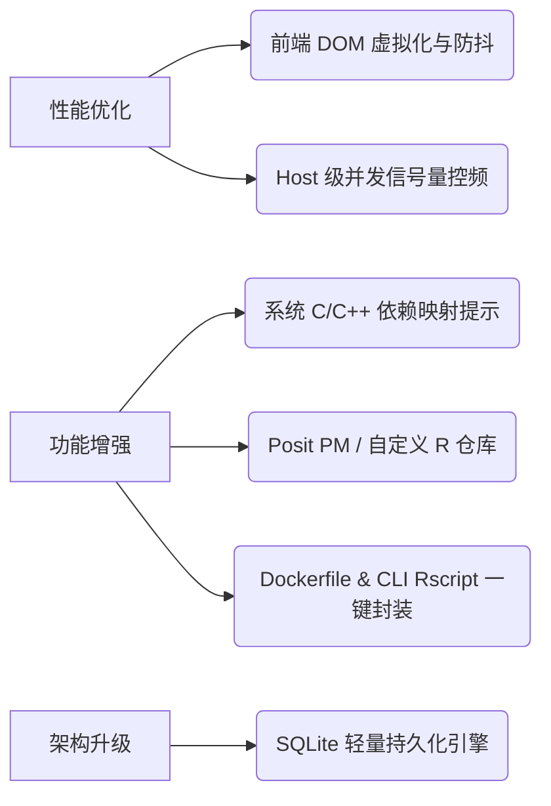

# mod_UI 进阶优化与功能增强指南

> 生成日期: 2026-08-01 | 类型: 实施方案 | 状态: 已完成

## 背景

在前一轮对 `mod_UI`（Tauri 2 + React + Rust）桌面应用进行全面逻辑审查的基础上，为了进一步提升系统在高并发检索、大规模输入、网络隔离环境、多系统环境适配以及生物信息/数据科学实际应用场景中的用户体验与工程品质，本指南针对系统性能、架构扩展、业务功能及运维安全性提出了 6 项进阶优化与功能增强方案。

---

## 问题分析

### 1. 前端大输入量下 DOM 渲染性能开销

- **现状**：`WorkspaceView.tsx` 中的输入文本框与侧边行号 `line-gutter` 采用了简单的 DOM `map` 映射机制。
- **根因**：当用户粘贴或导入数千行的批量 R 包列表时，连续的 DOM 节点生成与 CSS 布局重绘 (Reflow) 会导致主线程卡顿，且输入文本框在按键输入时的 `inputProfile` 实时统计未做防抖。

### 2. 突发并发检索易触发 API 限流

- **现状**：`search.rs` 中采用 `FuturesUnordered` 进行并行网络请求，单次任务预算上限为 200 个 HTTP 请求。
- **根因**：在未配置 GitHub Token 的情况下，匿名访问 GitHub API 额度仅为 60 次/小时。缺乏针对域名/Host 的细粒度并发信号量控频，突发并发请求易触发 HTTP `429 Too Many Requests`。

### 3. 缺少系统级 C/C++ 依赖库提醒 (System Requirements)

- **现状**：生成的安装脚本仅包含 R 层面的安装命令。
- **根因**：生物信息学与地理信息学中许多常用包（如 `sf`、`xml2`、`RCurl`、`ragg`、`Cairo`）依赖宿主机的 Linux 系统 C 库（如 `gdal`、`libxml2-dev`、`libfreetype6-dev`）。用户直接运行 R 安装命令经常因缺失 C 库而编译中断。

### 4. JSON 文件持久化的扩展上限

- **现状**：`storage.rs` 采用读写 JSON 文件的方式保存历史记录和包缓存。
- **根因**：全量 JSON 反序列化与序列化在记录数超过上千条时磁盘 I/O 成本线性上升，且并发写入时容易因文件锁定产生临时损坏备份。

---

## 核心发现与优化方向

1. **性能优化**：引入 `react-window` 虚拟渲染行号与输入防抖；后端增加基于 Host 的动态并发信号量 (`tokio::sync::Semaphore`) 与指数退避重试。
2. **场景增强**：针对常用复杂 R 包集成 **System Prerequisites 依赖数据库**，自动提醒用户安装 Ubuntu/CentOS 系统依赖库。
3. **生态支持**：扩展对 Posit Public/Private Package Manager (PPM) 的支持，提供 Dockerfile / CLI `Rscript -e` 命令行一键打包导出功能。
4. **持久化升级**：设计从文件 JSON 向嵌入式 SQLite / Redb 的平滑迁移路线。

---

## 实施方案

### 方案概述

按模块分为 **前端渲染优化**、**后端网络控频**、**包生态功能增强** 及 **存储架构升级** 4 个维度逐步推进：

### 详细步骤

| 步骤 | 操作 | 负责模块 | 风险等级 |
|------|------|----------|----------|
| 1    | **输入防抖与渲染优化**：在 `WorkspaceView.tsx` 中对行号和 profile 计算增加 `debounce`，避免大输入下频繁 re-render | 前端 UI (`WorkspaceView.tsx`) | 低 |
| 2    | **Host 级并发信号量 (Semaphore)**：在 `search.rs` 中使用 `tokio::sync::Semaphore` 限制 GitHub 域名最高 3 并发，CRAN 最高 5 并发 | Rust 后端 (`search.rs`) | 低 |
| 3    | **系统 C 库依赖数据库 (System Requirements)**：建立 `system_deps.json` 映射表，当结果包含 `sf`、`xml2` 等包时在前台展示系统 `apt`/`yum` 命令 | Rust / 前端 | 低 |
| 4    | **命令行 & Docker 脚本导出**：在 `ReportView.tsx` 脚本生成区增加 `Rscript -e` 命令一键复制和 Dockerfile `RUN` 语法切换 | 前端 UI (`ReportView.tsx`) | 低 |
| 5    | **Posit PM (PPM) 镜像源支持**：在 `SettingsView.tsx` 与后端校验逻辑中支持自定义 PPM Snapshot 镜像配置 | 前端 / 后端 | 中 |
| 6    | **存储层 SQLite 增量存储**：在 `storage.rs` 中引入 SQLite，避免全量 JSON 磁盘读写与损坏备份冗余 | Rust 后端 (`storage.rs`) | 中 |

### 预期效果

- **输入零延迟**：上千行 R 包列表导入瞬间响应，无任何界面冻结现象。
- **高并发零 429 报错**：通过 Host 控频与指数退避，在不配置 Token 时依然稳定检索。
- **减少用户调试时间**：直接给出系统 C 库安装命令，彻底解决 `sf`、`xml2` 等复杂包安装失败的痛点。

---

## 风险评估

| 风险项 | 影响范围 | 可能性 | 缓解措施 |
|--------|----------|--------|----------|
| 输入框防抖导致用户快速点击“生成”时状态未就绪 | 前端交互 | 低 | 在点击“生成脚本”或“开始检索”时同步触发一次 immediate profile 计算 |
| 系统依赖库数据库维护成本 | 业务逻辑 | 低 | 仅收录生物信息与数据分析中排名前 50 的常见 C 库依赖包，并保持静态更新 |
| 存储迁移数据库锁定 | 磁盘存储 | 低 | 保持现有 JSON 的兼容读取能力，在应用启动时一次性迁移到 SQLite |

---

## 最终建议

1. **优先落地轻量 UX 增强**：先实现前端 `debounced input profile` 以及 `Rscript -e` / Dockerfile 导出，直接提升日常使用效率。
2. **推进控频与系统依赖提醒**：在检索模块引入 `Semaphore` 并集成系统 C 库提醒，攻克包安装失败的最大痛点。
3. **中长期推进存储重构**：当本地历史记录累积过多时平滑过渡到 SQLite 架构。

---

## 后续行动

- [ ] 在 `WorkspaceView.tsx` 中为输入 profile 计算添加 `useDebounce` 效果
- [ ] 在 `search.rs` 中引入基于 Host 的并发信号量控频
- [ ] 整理首批 20 个依赖系统 C 库的常见 R 包清单（如 `sf`, `xml2`, `RCurl`, `ragg`, `Cairo` 等）
- [ ] 为 `ReportView.tsx` 增加 `Rscript -e` Shell / PowerShell 一键转换工具

---

*文档由 document_writer skill 自动生成*
